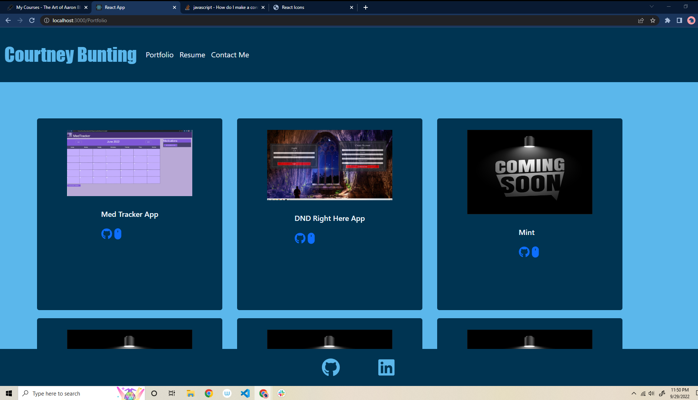

# My React Portfolio

## Description

This project is meant to display my current skills as a web developer and serve as a means to display the skills that I learn in the future as well.

## Table of Contents

- [Installation](#installation)
- [Usage](#usage)
- [Contributing](#how-to-contribute)
- [Tests](#tests)
- [License](#license)
- [Credits](#credits)

## Installation

run npm start in the console after cloning the repository from GitHub.

## Usage

The application will allow users to view an about me page, send information through a contact form, view my projects, and a resume page displaying my skills.

## How to Contribute

## Tests

There are no tests for this application

## License

Mozilla

## Questions

for questions please refer to my [GitHub](https://github.com/bunt88)
or contact me through my [Email](bunt88@gmail.com)
